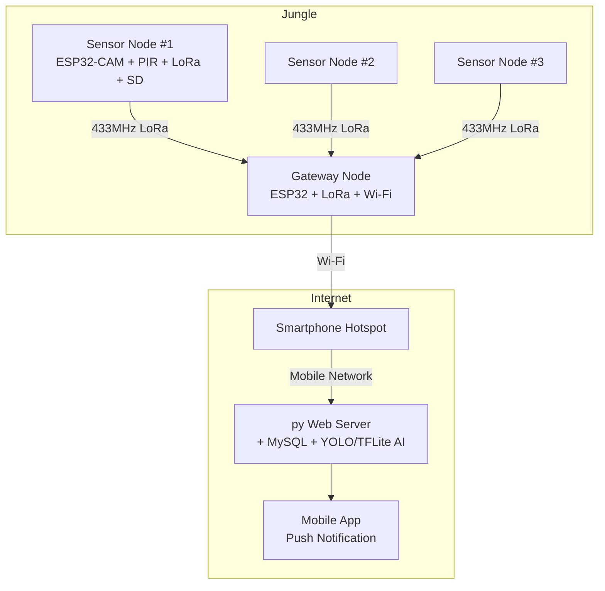
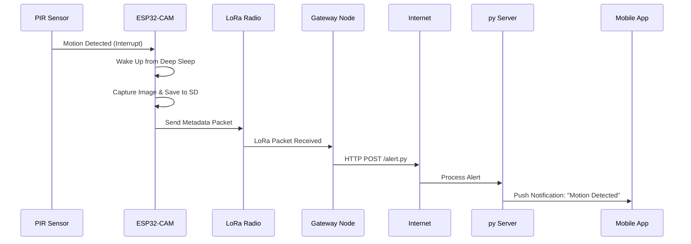
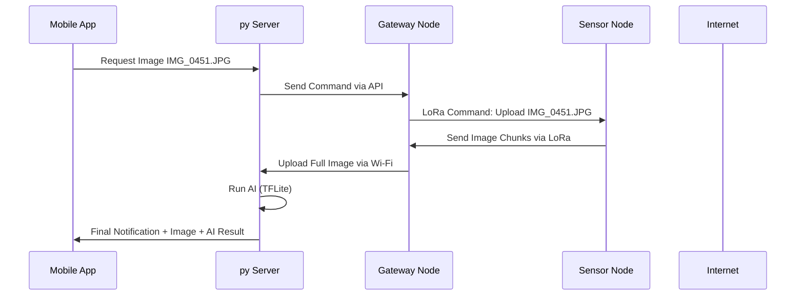

---

#  Project HERD - Jungle Wildlife Intrusion Detection System using ESP32-CAM, LoRa, and Mobile-Connected Gateway

## 📌 Project Overview

This project aims to build a **long-range, low-power, camera-based wildlife monitoring system** using **ESP32-CAM + LoRa** sensor nodes and a **Gateway Node** connected to a mobile network (via smartphone hotspot or LTE module). The system detects motion (e.g., elephant intrusions), captures an image, and relays alerts through a chain of communication to a central **py web server** with **AI-powered image analysis (TensorFlow Lite)**.

---

## 🌐 High-Level Architecture



---

## 📦 Hardware Components

### 1. Sensor Node (ESP32-CAM + SX1278 + PIR)

* **ESP32-CAM Module**
* **SX1278/SX1276 LoRa module @433MHz**
* **PIR Sensor (e.g., HC-SR501)**
* **MicroSD card for image storage**
* **Solar panel + TP4056 charger + LiPo battery**

### 2. Gateway Node

* **ESP32 (or ESP32-CAM reused)**
* **LoRa Module**
* **Wi-Fi (via smartphone hotspot or LTE module)**
* **Large solar panel + battery (always-on)**

---

## ⚙️ Software Stack

### 📍 Sensor Node Firmware

* ESP32 wakes on motion (via PIR)
* Captures and stores image on SD card
* Sends metadata (Node ID, filename, battery level) via LoRa

### 📍 Gateway Node Firmware

* Continuously listens for LoRa packets
* On receive, makes HTTP POST request to `alert.py` on server using smartphone Wi-Fi

### 📍 py Web Server

* `alert.py`: Stores metadata, triggers push notifications
* `get_image.py`: Retrieves image via on-demand LoRa command relay
* TensorFlow Lite model runs AI detection (e.g., Elephant detection)
* Sends image + AI result to mobile app

---

## 🔁 Workflow Diagram (Mermaid)

### 🌿 Detection Workflow



### 📸 On-Demand Image Retrieval



---

## 🔌 Can It Connect from Deep Jungle?

Yes, **LoRa @433MHz** allows **line-of-sight communication up to 10+ km**, especially in rural or jungle terrains with low interference. However:

* **Nodes far from the Gateway** should **relay** their message via intermediate nodes (multi-hop if needed).
* You can implement **LoRa Mesh-like** behavior (basic repeaters) using Time Division or Address-based forwarding.
* The **Gateway** is the only component requiring **internet access**, typically placed at the edge (ranger station, tree top, or watchtower) using:

  * Smartphone hotspot (Wi-Fi)
  * SIM7600 4G module

---

## 🧠 Local AI on Gateway (TFLite on Android)

> Yes, the **smartphone providing Wi-Fi hotspot** can **also run TensorFlow Lite model** to classify elephant images **before uploading to the server**.

This has advantages:

* Reduce bandwidth (upload only confirmed images)
* Lower server load
* Quicker confirmation

You can:

* Build a background Android service (e.g., Kotlin app with Firebase + TFLite)
* Use an auto-upload folder (where the ESP uploads images to the phone via FTP or shared folder)
* Run `tflite.Interpreter` in Android app for inference

---

## 🔧 Example Payload

### LoRa Alert Packet (from Sensor Node):

```json
{
  "node_id": "Node_12",
  "event": "Motion",
  "file": "IMG_0451.JPG",
  "battery": 3.85
}
```

### HTTP POST to Server:

```http
POST /api/alert.py
Content-Type: application/json

{
  "node_id": "Node_12",
  "file": "IMG_0451.JPG",
  "timestamp": "2025-07-09T20:00:00",
  "battery": 3.85
}
```

---

## 🔐 Security Recommendations

* Use HTTPS on your server
* Include `auth_token` in API requests from Gateway
* Monitor for spoofed LoRa packets (add signature or CRC)

---

## 🧪 Testing Recommendations

1. Simulate PIR event manually
2. Check LoRa transmission from Node to Gateway
3. Validate gateway to server HTTP request
4. Push test payloads to Firebase
5. Test TFLite inference on Android

---

## 📁 Directory Structure

```
/firmware
  └── sensor_node.ino
  └── gateway_node.ino
/server

/app
