#  Project HERD - Jungle Wildlife Intrusion Detection System using ESP-NOW Wi-Fi Mesh with AI Processing

## 📌 Project Overview

This project aims to build a **real-time wildlife monitoring system** using **ESP32-CAM + ESP-NOW** sensor nodes for instant alerts with automatic image transmission through a **Wi-Fi mesh network**. The system detects motion, captures images, and forwards them through the mesh to a **Gateway with TensorFlow Lite AI processing** for verification before sending confirmed detections to a **FastAPI backend** and **Flutter mobile app**.

**Key Insight**: ESP-NOW provides efficient mesh networking with much lower power than traditional Wi-Fi, enabling automated image delivery from all nodes without dangerous manual collection in the jungle.

I'll help you design a multi-gateway architecture for your ESP-NOW mesh network. Let me first explore your current project structure to understand the existing implementation. Great! I can see your current architecture has a single gateway. Let me design a **multi-gateway ESP-NOW mesh architecture** that will provide better coverage, redundancy, and load distribution. Here's the enhanced design:

## 🌐 **Multi-Gateway ESP-NOW Mesh Architecture**

### **🎯 Updated High-Level Architecture**

````mermaid
graph TD
    subgraph Jungle[Multi-Gateway ESP-NOW Mesh Network]
        Node1[Sensor Node A<br>ESP32-CAM + PIR]
        Node2[Sensor Node B<br>ESP32-CAM + PIR]
        Node3[Sensor Node C<br>ESP32-CAM + PIR]
        Node4[Sensor Node D<br>ESP32-CAM + PIR]
        Node5[Sensor Node E<br>ESP32-CAM + PIR]
        Node6[Sensor Node F<br>ESP32-CAM + PIR]
        
        GW1[Gateway 1<br>ESP32 + Android + 4G<br>Zone North]
        GW2[Gateway 2<br>ESP32 + Android + 4G<br>Zone South]
        GW3[Gateway 3<br>ESP32 + Android + 4G<br>Zone East]
    end
    
    subgraph Internet
        FastAPI[FastAPI Backend<br>+ Database + Push Notifications]
        Flutter[Flutter Mobile App<br>Unified Alerts]
    end

    Node1 -.->|ESP-NOW| GW1
    Node2 -.->|ESP-NOW| GW1
    Node3 -.->|ESP-NOW| GW2
    Node4 -.->|ESP-NOW| GW2
    Node5 -.->|ESP-NOW| GW3
    Node6 -.->|ESP-NOW| GW3
    
    %% Inter-gateway communication
    GW1 -.->|ESP-NOW Backup| GW2
    GW2 -.->|ESP-NOW Backup| GW3
    GW3 -.->|ESP-NOW Backup| GW1
    
    GW1 -->|HTTP POST| FastAPI
    GW2 -->|HTTP POST| FastAPI
    GW3 -->|HTTP POST| FastAPI
    FastAPI --> Flutter
````

### **🔧 Multi-Gateway Hardware Components**

#### **1. Enhanced Gateway Node (ESP32 + Android + Hotspot)**

````bash
# Gateway Hardware Stack:
# - ESP32 DevKit (ESP-NOW mesh receiver)
# - Android smartphone/tablet (TFLite AI processing)
# - Wi-Fi Hotspot capability (for ESP32 ↔ Android communication)
# - 4G/LTE connection (for backend communication)
# - Large solar panel + battery bank (5000-10000mAh)
# - Weatherproof enclosure with antenna mounts
````

**Gateway Components:**
- **ESP32 Module**: ESP-NOW mesh communication + Wi-Fi hotspot client
- **Android Device**: TFLite processing + hotspot server + 4G uplink
- **Power System**: Large solar panel (20W+) + LiPo bank (10000mAh)
- **Enclosure**: Weatherproof with external antennas

### **📡 ESP-NOW Multi-Gateway Mesh Implementation**

````cpp
// Multi-Gateway ESP32 Firmware
#include "esp_now.h"
#include "WiFi.h"
#include <vector>

// Multi-gateway configuration
struct GatewayInfo {
    uint8_t mac[6];
    String zone;
    uint8_t priority;  // 1=primary, 2=secondary, 3=tertiary
    bool isActive;
    uint32_t lastSeen;
};

std::vector<GatewayInfo> gatewayList = {
    {{0x24, 0x6F, 0x28, 0xB5, 0x36, 0xE4}, "North", 1, true, 0},  // Primary
    {{0x24, 0x6F, 0x28, 0xB5, 0x36, 0xE5}, "South", 2, true, 0},  // Secondary  
    {{0x24, 0x6F, 0x28, 0xB5, 0x36, 0xE6}, "East", 3, true, 0}    // Tertiary
};

uint8_t currentGateway = 0;  // Index of current primary gateway

void setupMultiGatewayMesh() {
    WiFi.mode(WIFI_STA);
    WiFi.disconnect();
    
    if (esp_now_init() != ESP_OK) {
        Serial.println("ESP-NOW init failed");
        return;
    }
    
    esp_now_register_send_cb(onDataSent);
    esp_now_register_recv_cb(onDataReceived);
    
    // Add all gateways as peers
    for (auto& gateway : gatewayList) {
        esp_now_peer_info_t peerInfo;
        memcpy(peerInfo.peer_addr, gateway.mac, 6);
        peerInfo.channel = 0;
        peerInfo.encrypt = false;
        esp_now_add_peer(&peerInfo);
    }
    
    Serial.println("Multi-gateway ESP-NOW mesh initialized");
}

// Smart gateway selection with failover
uint8_t selectBestGateway() {
    // Try primary gateway first
    for (int i = 0; i < gatewayList.size(); i++) {
        if (gatewayList[i].isActive && gatewayList[i].priority == 1) {
            return i;
        }
    }
    
    // Fallback to secondary gateways
    for (int priority = 2; priority <= 3; priority++) {
        for (int i = 0; i < gatewayList.size(); i++) {
            if (gatewayList[i].isActive && gatewayList[i].priority == priority) {
                return i;
            }
        }
    }
    
    return 0; // Default to first gateway
}

// Enhanced image forwarding with multi-gateway support
void forwardImageWithFailover(uint8_t* imageData, size_t size, uint32_t timestamp) {
    uint8_t attempts = 0;
    bool transmitted = false;
    
    while (attempts < 3 && !transmitted) {
        uint8_t gatewayIndex = selectBestGateway();
        
        Serial.printf("Attempting transmission to Gateway %s (Attempt %d)\n", 
                     gatewayList[gatewayIndex].zone.c_str(), attempts + 1);
        
        // Split image into ESP-NOW packets
        if (transmitImagePackets(imageData, size, gatewayList[gatewayIndex].mac, timestamp)) {
            transmitted = true;
            Serial.printf("✅ Image successfully sent to Gateway %s\n", 
                         gatewayList[gatewayIndex].zone.c_str());
        } else {
            // Mark gateway as potentially down and try next
            gatewayList[gatewayIndex].isActive = false;
            attempts++;
            delay(1000); // Wait before retry
        }
    }
    
    if (!transmitted) {
        Serial.println("❌ Failed to transmit to any gateway, storing for later retry");
        storeImageForRetry(imageData, size, timestamp);
    }
}

// Gateway heartbeat system
void sendHeartbeatToGateways() {
    MeshPacket heartbeat;
    heartbeat.type = HEARTBEAT;
    heartbeat.nodeId = NODE_ID;
    heartbeat.timestamp = millis();
    heartbeat.batteryVoltage = readBatteryVoltage();
    
    for (auto& gateway : gatewayList) {
        esp_now_send(gateway.mac, (uint8_t*)&heartbeat, sizeof(heartbeat));
    }
}

// Enhanced packet transmission with acknowledgment
bool transmitImagePackets(uint8_t* imageData, size_t size, uint8_t* gatewayMAC, uint32_t timestamp) {
    size_t packetSize = 200;
    size_t totalPackets = (size + packetSize - 1) / packetSize;
    uint8_t ackReceived = 0;
    
    // Send image header first
    MeshPacket header;
    header.type = IMAGE_HEADER;
    header.nodeId = NODE_ID;
    header.timestamp = timestamp;
    header.totalPackets = totalPackets;
    header.imageSize = size;
    
    esp_err_t result = esp_now_send(gatewayMAC, (uint8_t*)&header, sizeof(header));
    if (result != ESP_OK) return false;
    
    delay(100); // Wait for header processing
    
    // Send image data packets
    for (size_t i = 0; i < totalPackets; i++) {
        MeshPacket packet;
        packet.type = IMAGE_DATA;
        packet.packetIndex = i;
        packet.totalPackets = totalPackets;
        packet.nodeId = NODE_ID;
        packet.timestamp = timestamp;
        
        size_t currentPacketSize = min(packetSize, size - (i * packetSize));
        memcpy(packet.data, imageData + (i * packetSize), currentPacketSize);
        packet.dataSize = currentPacketSize;
        
        // Send with retry mechanism
        int retries = 0;
        while (retries < 3) {
            if (esp_now_send(gatewayMAC, (uint8_t*)&packet, sizeof(packet)) == ESP_OK) {
                break;
            }
            retries++;
            delay(50);
        }
        
        if (retries >= 3) return false;
        delay(20); // Small delay between packets
    }
    
    return true;
}
````

### **📱 Enhanced Android Gateway App with Hotspot**

````java
// Multi-Gateway Android TFLite Service
public class MultiGatewayTFLiteService extends Service {
    private static final String TAG = "MultiGatewayTFLite";
    private static final String GATEWAY_ID = Build.MODEL + "_" + Settings.Secure.ANDROID_ID;
    
    private Interpreter tflite;
    private WifiManager wifiManager;
    private boolean isHotspotEnabled = false;
    private ESP32CommunicationManager esp32Manager;
    
    @Override
    public void onCreate() {
        super.onCreate();
        initializeTFLite();
        setupWiFiHotspot();
        esp32Manager = new ESP32CommunicationManager(this);
        registerWithBackend();
    }
    
    private void setupWiFiHotspot() {
        wifiManager = (WifiManager) getApplicationContext().getSystemService(Context.WIFI_SERVICE);
        
        // Configure hotspot for ESP32 communication
        WifiConfiguration hotspotConfig = new WifiConfiguration();
        hotspotConfig.SSID = "HERD_Gateway_" + GATEWAY_ID;
        hotspotConfig.preSharedKey = "HerdGateway2024";
        hotspotConfig.hiddenSSID = false;
        hotspotConfig.allowedKeyManagement.set(WifiConfiguration.KeyMgmt.WPA_PSK);
        
        // Enable mobile hotspot
        try {
            Method setHotspot = wifiManager.getClass().getMethod("setWifiApEnabled", 
                WifiConfiguration.class, boolean.class);
            setHotspot.invoke(wifiManager, hotspotConfig, true);
            isHotspotEnabled = true;
            Log.i(TAG, "✅ WiFi Hotspot enabled: " + hotspotConfig.SSID);
        } catch (Exception e) {
            Log.e(TAG, "❌ Failed to enable hotspot", e);
        }
    }
    
    private void registerWithBackend() {
        // Register this gateway with the backend
        GatewayRegistration registration = new GatewayRegistration();
        registration.gatewayId = GATEWAY_ID;
        registration.zone = getZoneFromLocation();
        registration.capabilities = Arrays.asList("TFLite", "ESP-NOW", "4G");
        registration.status = "ACTIVE";
        registration.lastSeen = System.currentTimeMillis();
        
        ApiClient.getInstance().registerGateway(registration);
    }
    
    // Enhanced image processing with gateway coordination
    public void processImageFromMesh(byte[] imageData, String nodeId, long timestamp) {
        try {
            // Run TFLite inference
            DetectionResult result = runWildlifeDetection(imageData);
            
            // Create detection event
            WildlifeDetection detection = new WildlifeDetection();
            detection.nodeId = nodeId;
            detection.gatewayId = GATEWAY_ID;
            detection.timestamp = timestamp;
            detection.imageData = Base64.encodeToString(imageData, Base64.DEFAULT);
            detection.confidence = result.confidence;
            detection.species = result.species;
            detection.boundingBox = result.boundingBox;
            detection.isWildlife = result.isWildlife;
            
            // Send to backend with gateway info
            if (result.isWildlife && result.confidence > 0.7f) {
                sendWildlifeAlert(detection);
                Log.i(TAG, String.format("🐘 Wildlife detected by Gateway %s: %s (%.2f confidence)", 
                    GATEWAY_ID, result.species, result.confidence));
            } else {
                logFalsePositive(detection);
            }
            
            // Send processing acknowledgment back to ESP32
            esp32Manager.sendProcessingAck(nodeId, timestamp, result.isWildlife);
            
        } catch (Exception e) {
            Log.e(TAG, "❌ Error processing image", e);
        }
    }
    
    private DetectionResult runWildlifeDetection(byte[] imageData) {
        // Preprocess image for TFLite
        ByteBuffer inputBuffer = preprocessImage(imageData);
        
        // Run inference
        float[][] output = new float[1][NUM_CLASSES];
        tflite.run(inputBuffer, output);
        
        // Parse results
        float elephantConf = output[0][ELEPHANT_CLASS];
        float tigerConf = output[0][TIGER_CLASS];
        float maxConf = Math.max(elephantConf, tigerConf);
        
        DetectionResult result = new DetectionResult();
        result.confidence = maxConf;
        result.isWildlife = maxConf > 0.7f;
        result.species = elephantConf > tigerConf ? "elephant" : "tiger";
        result.processingTimeMs = System.currentTimeMillis() - startTime;
        
        return result;
    }
}

// ESP32 Communication Manager
public class ESP32CommunicationManager {
    private ServerSocket serverSocket;
    private boolean isListening = false;
    
    public ESP32CommunicationManager(MultiGatewayTFLiteService service) {
        this.service = service;
        startListening();
    }
    
    private void startListening() {
        new Thread(() -> {
            try {
                serverSocket = new ServerSocket(8080); // ESP32 connects here
                isListening = true;
                
                while (isListening) {
                    Socket clientSocket = serverSocket.accept();
                    handleESP32Connection(clientSocket);
                }
            } catch (IOException e) {
                Log.e(TAG, "Error in ESP32 communication", e);
            }
        }).start();
    }
    
    private void handleESP32Connection(Socket socket) {
        try {
            InputStream input = socket.getInputStream();
            OutputStream output = socket.getOutputStream();
            
            // Read image data from ESP32
            byte[] imageData = readImageFromStream(input);
            String nodeId = readNodeIdFromStream(input);
            long timestamp = readTimestampFromStream(input);
            
            // Process image with TFLite
            service.processImageFromMesh(imageData, nodeId, timestamp);
            
            // Send acknowledgment
            output.write("ACK".getBytes());
            output.flush();
            
        } catch (IOException e) {
            Log.e(TAG, "Error handling ESP32 connection", e);
        } finally {
            try {
                socket.close();
            } catch (IOException e) {
                Log.e(TAG, "Error closing ESP32 socket", e);
            }
        }
    }
}
````

### **🔄 Multi-Gateway Coordination Backend**

````python
# Enhanced FastAPI Backend for Multi-Gateway Support
from fastapi import FastAPI, HTTPException
from pydantic import BaseModel
from typing import List, Dict, Optional
import asyncio
from datetime import datetime, timedelta

app = FastAPI(title="HERD Multi-Gateway Backend")

# Gateway management
class GatewayInfo(BaseModel):
    gateway_id: str
    zone: str
    capabilities: List[str]
    status: str  # ACTIVE, OFFLINE, MAINTENANCE
    last_seen: datetime
    processed_detections: int
    avg_response_time: float

class WildlifeDetection(BaseModel):
    node_id: str
    gateway_id: str
    timestamp: datetime
    species: str
    confidence: float
    image_data: str
    bounding_box: List[int]
    is_wildlife: bool
    processing_time_ms: int

# Gateway registry
active_gateways: Dict[str, GatewayInfo] = {}

@app.post("/gateway/register")
async def register_gateway(gateway: GatewayInfo):
    """Register a new gateway or update existing one"""
    active_gateways[gateway.gateway_id] = gateway
    
    await db.gateways.upsert({
        "gateway_id": gateway.gateway_id,
        "zone": gateway.zone,
        "capabilities": gateway.capabilities,
        "status": gateway.status,
        "last_seen": gateway.last_seen,
        "registered_at": datetime.utcnow()
    })
    
    print(f"✅ Gateway {gateway.gateway_id} registered for zone {gateway.zone}")
    return {"status": "registered", "gateway_id": gateway.gateway_id}

@app.post("/gateway/heartbeat/{gateway_id}")
async def gateway_heartbeat(gateway_id: str):
    """Update gateway last seen timestamp"""
    if gateway_id in active_gateways:
        active_gateways[gateway_id].last_seen = datetime.utcnow()
        await db.gateways.update_one(
            {"gateway_id": gateway_id},
            {"$set": {"last_seen": datetime.utcnow(), "status": "ACTIVE"}}
        )
    return {"status": "heartbeat_received"}

@app.post("/wildlife-detection")
async def receive_wildlife_detection(detection: WildlifeDetection):
    """Enhanced wildlife detection with gateway coordination"""
    
    # Validate gateway
    if detection.gateway_id not in active_gateways:
        raise HTTPException(status_code=400, detail="Unknown gateway")
    
    # Check for duplicate detections (same node, similar timestamp)
    recent_threshold = datetime.utcnow() - timedelta(minutes=5)
    duplicate = await db.detections.find_one({
        "node_id": detection.node_id,
        "timestamp": {"$gte": recent_threshold},
        "is_wildlife": True
    })
    
    if duplicate:
        print(f"⚠️ Duplicate detection filtered: {detection.node_id}")
        return {"status": "duplicate_filtered"}
    
    # Store detection
    detection_doc = {
        "node_id": detection.node_id,
        "gateway_id": detection.gateway_id,
        "timestamp": detection.timestamp,
        "species": detection.species,
        "confidence": detection.confidence,
        "image_data": detection.image_data,
        "bounding_box": detection.bounding_box,
        "is_wildlife": detection.is_wildlife,
        "processing_time_ms": detection.processing_time_ms,
        "created_at": datetime.utcnow()
    }
    
    await db.detections.insert_one(detection_doc)
    
    # Update gateway stats
    gateway = active_gateways[detection.gateway_id]
    gateway.processed_detections += 1
    gateway.avg_response_time = (gateway.avg_response_time + detection.processing_time_ms) / 2
    
    # Send push notification for confirmed wildlife
    if detection.is_wildlife and detection.confidence > 0.7:
        await send_wildlife_alert_notification(detection)
        print(f"🐘 Wildlife alert sent: {detection.species} detected by {detection.gateway_id}")
    
    return {"status": "detection_processed", "alert_sent": detection.is_wildlife}

@app.get("/gateways/status")
async def get_gateway_status():
    """Get status of all gateways"""
    gateway_status = []
    current_time = datetime.utcnow()
    
    for gateway_id, gateway in active_gateways.items():
        time_since_last_seen = (current_time - gateway.last_seen).total_seconds()
        status = "ACTIVE" if time_since_last_seen < 300 else "OFFLINE"  # 5 minutes timeout
        
        gateway_status.append({
            "gateway_id": gateway_id,
            "zone": gateway.zone,
            "status": status,
            "last_seen": gateway.last_seen,
            "processed_detections": gateway.processed_detections,
            "avg_response_time": gateway.avg_response_time
        })
    
    return {"gateways": gateway_status, "total_active": len([g for g in gateway_status if g["status"] == "ACTIVE"])}

async def send_wildlife_alert_notification(detection: WildlifeDetection):
    """Send push notification with gateway information"""
    gateway = active_gateways.get(detection.gateway_id, {})
    zone = getattr(gateway, 'zone', 'Unknown')
    
    notification_payload = {
        "title": f"🐘 {detection.species.title()} Alert!",
        "body": f"Wildlife detected in {zone} zone by Gateway {detection.gateway_id}",
        "data": {
            "node_id": detection.node_id,
            "gateway_id": detection.gateway_id,
            "zone": zone,
            "species": detection.species,
            "confidence": detection.confidence,
            "timestamp": detection.timestamp.isoformat(),
            "image_url": await upload_image_to_cdn(detection.image_data)
        }
    }
    
    # Send to all registered Flutter apps
    await fcm_service.send_to_all(notification_payload)

# Gateway load balancing (future enhancement)
@app.get("/gateway/recommend/{node_id}")
async def recommend_gateway(node_id: str):
    """Recommend best gateway for a specific node"""
    # Simple round-robin for now, can be enhanced with distance/load balancing
    active_gateway_list = [g for g in active_gateways.values() if g.status == "ACTIVE"]
    
    if not active_gateway_list:
        raise HTTPException(status_code=503, detail="No active gateways available")
    
    # Select gateway with lowest load
    recommended = min(active_gateway_list, key=lambda x: x.processed_detections)
    
    return {
        "recommended_gateway": recommended.gateway_id,
        "zone": recommended.zone,
        "current_load": recommended.processed_detections
    }
````

### **🗺️ Multi-Gateway Deployment Strategy**

````bash
# Optimal Multi-Gateway Placement for Jungle Coverage

Zone Coverage Layout:
┌─────────────────────────────────────────────────────┐
│                    JUNGLE AREA                      │
│                                                     │
│   [GW1-North] ←→ [Node A] ←→ [Node B]              │
│       │              │         │                   │
│   [Node C] ←→    [Node D] ←→ [Node E] ←→ [GW2-East] │
│       │              │         │          │        │
│   [Node F] ←→    [Node G] ←→ [Node H] ←→ [Node I]   │
│                      │                              │
│                  [GW3-South]                        │
│                                                     │
└─────────────────────────────────────────────────────┘

Coverage Benefits:
✅ **Redundancy**: Multiple gateways ensure no single point of failure
✅ **Load Distribution**: TFLite processing distributed across 3 Android devices  
✅ **Extended Range**: 3x coverage area vs single gateway
✅ **Faster Processing**: Parallel AI processing on multiple gateways
✅ **Zone Identification**: Each gateway covers specific geographical zone
````

### **🔄 Key Benefits of Multi-Gateway Architecture**

**1. Improved Reliability:**
- No single point of failure
- Automatic failover between gateways
- Multiple paths for image transmission

**2. Better Coverage:**
- 3x larger monitoring area
- Reduced hop count per node (shorter transmission paths)
- Zone-based detection and alerts

**3. Load Distribution:**
- TFLite processing distributed across multiple Android devices
- Reduced processing latency per detection
- Parallel AI inference capability

**4. Enhanced Features:**
- Zone-specific alerts ("Elephant in North Zone")
- Gateway status monitoring
- Load balancing for optimal performance

This multi-gateway architecture significantly improves your system's scalability, reliability, and coverage while maintaining the power efficiency and automation benefits of ESP-NOW mesh networking! 🐘📱

Similar code found with 2 license types
---

## 🌐 High-Level Architecture


---
/*
 * HERD Sensor Node ESP32-CAM Firmware
 * Handles motion detection, image capture, and ESP-NOW mesh transmission
 * Includes multi-gateway support with automatic failover
 */

#include "esp_camera.h"
#include "esp_now.h"
#include "WiFi.h"
#include "esp_wifi.h"
#include "esp_sleep.h"
#include "driver/rtc_io.h"
#include <vector>

// Node Configuration
#define NODE_ID "HERD_NODE_001"  // Change for each node
#define PIR_PIN GPIO_NUM_13
#define FLASH_LED_PIN GPIO_NUM_4
#define BATTERY_PIN A0

// Camera Configuration (AI-Thinker ESP32-CAM)
#define PWDN_GPIO_NUM     32
#define RESET_GPIO_NUM    -1
#define XCLK_GPIO_NUM      0
#define SIOD_GPIO_NUM     26
#define SIOC_GPIO_NUM     27
#define Y9_GPIO_NUM       35
#define Y8_GPIO_NUM       34
#define Y7_GPIO_NUM       39
#define Y6_GPIO_NUM       36
#define Y5_GPIO_NUM       21
#define Y4_GPIO_NUM       19
#define Y3_GPIO_NUM       18
#define Y2_GPIO_NUM        5
#define VSYNC_GPIO_NUM    25
#define HREF_GPIO_NUM     23
#define PCLK_GPIO_NUM     22

// Power Management
#define DEEP_SLEEP_DURATION 300000000  // 5 minutes in microseconds
#define MAX_WAKE_TIME 60000            // 1 minute max wake time
#define LOW_BATTERY_THRESHOLD 3.3      // Volts

// Mesh Configuration
#define MAX_RETRIES 3
#define PACKET_DELAY_MS 50
#define ACK_TIMEOUT_MS 5000

// Packet Types (same as gateway)
enum PacketType {
    IMAGE_HEADER = 0x01,
    IMAGE_DATA = 0x02,
    IMAGE_ACK = 0x03,
    HEARTBEAT = 0x04,
    NODE_STATUS = 0x05,
    GATEWAY_BEACON = 0x06
};

// Mesh Packet Structure (same as gateway)
struct MeshPacket {
    uint8_t type;
    uint8_t nodeId[6];
    uint8_t gatewayId[6];
    uint32_t timestamp;
    uint16_t packetIndex;
    uint16_t totalPackets;
    uint16_t dataSize;
    uint32_t imageSize;
    float batteryVoltage;
    int16_t rssi;
    uint8_t data[200];
    uint16_t checksum;
} __attribute__((packed));

// Gateway Information
struct GatewayInfo {
    uint8_t mac[6];
    String zone;
    int16_t rssi;
    unsigned long lastSeen;
    bool isActive;
    uint8_t priority;  // 1=primary, 2=secondary, etc.
};

// Global Variables
std::vector<GatewayInfo> availableGateways;
int currentGatewayIndex = -1;
uint32_t bootCount = 0;
bool motionDetected = false;
unsigned long wakeupTime = 0;
float batteryVoltage = 0.0;

// RTC Memory for persistent data
RTC_DATA_ATTR uint32_t rtc_bootCount = 0;
RTC_DATA_ATTR uint8_t rtc_primaryGateway[6] = {0};

void setup() {
    Serial.begin(115200);
    wakeupTime = millis();
    bootCount = ++rtc_bootCount;
    
    Serial.printf("\n🌿 HERD Sensor Node %s - Boot #%d\n", NODE_ID, bootCount);
    
    // Check wakeup reason
    esp_sleep_wakeup_cause_t wakeup_reason = esp_sleep_get_wakeup_cause();
    
    switch (wakeup_reason) {
        case ESP_SLEEP_WAKEUP_EXT0:
            Serial.println("🎯 Wakeup caused by PIR motion detection");
            motionDetected = true;
            break;
        case ESP_SLEEP_WAKEUP_TIMER:
            Serial.println("⏰ Wakeup caused by timer (heartbeat)");
            motionDetected = false;
            break;
        default:
            Serial.println("🔄 First boot or power-on reset");
            motionDetected = false;
            break;
    }
    
    // Read battery voltage
    batteryVoltage = readBatteryVoltage();
    Serial.printf("🔋 Battery voltage: %.2fV\n", batteryVoltage);
    
    // Check for low battery
    if (batteryVoltage < LOW_BATTERY_THRESHOLD) {
        Serial.println("⚠️ Low battery! Entering extended sleep mode");
        enterExtendedSleep();
        return;
    }
    
    // Initialize WiFi and ESP-NOW
    setupESPNow();
    
    // Discover gateways
    discoverGateways();
    
    if (motionDetected) {
        // Handle motion detection
        handleMotionDetection();
    } else {
        // Send heartbeat
        sendHeartbeat();
    }
    
    // Enter deep sleep
    enterDeepSleep();
}

void loop() {
    // Should never reach here due to deep sleep
    delay(1000);
}

void setupESPNow() {
    WiFi.mode(WIFI_STA);
    WiFi.disconnect();
    
    // Get node MAC address
    uint8_t mac[6];
    esp_wifi_get_mac(WIFI_IF_STA, mac);
    Serial.printf("Node MAC: %02X:%02X:%02X:%02X:%02X:%02X\n", 
                  mac[0], mac[1], mac[2], mac[3], mac[4], mac[5]);
    
    // Initialize ESP-NOW
    if (esp_now_init() != ESP_OK) {
        Serial.println("❌ ESP-NOW init failed");
        enterDeepSleep();
        return;
    }
    
    // Register callbacks
    esp_now_register_send_cb(onDataSent);
    esp_now_register_recv_cb(onDataReceived);
    
    Serial.println("✅ ESP-NOW initialized");
}

void discoverGateways() {
    Serial.println("🔍 Discovering gateways...");
    
    // Clear previous gateway list
    availableGateways.clear();
    
    // Listen for gateway beacons for 5 seconds
    unsigned long startTime = millis();
    while (millis() - startTime < 5000) {
        delay(100);
    }
    
    if (availableGateways.empty()) {
        // Fallback to RTC stored gateway
        if (rtc_primaryGateway[0] != 0) {
            Serial.println("📡 Using RTC stored gateway");
            GatewayInfo gateway;
            memcpy(gateway.mac, rtc_primaryGateway, 6);
            gateway.zone = "Unknown";
            gateway.priority = 1;
            gateway.isActive = true;
            gateway.lastSeen = millis();
            availableGateways.push_back(gateway);
        } else {
            Serial.println("❌ No gateways found!");
            enterDeepSleep();
            return;
        }
    }
    
    // Sort gateways by priority and signal strength
    sortGatewaysByPriority();
    
    // Add best gateway as ESP-NOW peer
    addGatewayAsPeer(0);
    
    Serial.printf("✅ Found %d gateway(s)\n", availableGateways.size());
}

void sortGatewaysByPriority() {
    // Simple priority sorting - can be enhanced with RSSI
    std::sort(availableGateways.begin(), availableGateways.end(), 
              [](const GatewayInfo& a, const GatewayInfo& b) {
                  return a.priority < b.priority;
              });
}

void addGatewayAsPeer(int index) {
    if (index >= availableGateways.size()) return;
    
    esp_now_peer_info_t peerInfo;
    memcpy(peerInfo.peer_addr, availableGateways[index].mac, 6);
    peerInfo.channel = 0;
    peerInfo.encrypt = false;
    
    if (esp_now_add_peer(&peerInfo) == ESP_OK) {
        currentGatewayIndex = index;
        Serial.printf("✅ Added gateway %s as peer\n", 
                     availableGateways[index].zone.c_str());
        
        // Store in RTC memory
        memcpy(rtc_primaryGateway, availableGateways[index].mac, 6);
    }
}

void handleMotionDetection() {
    Serial.println("📸 Motion detected! Capturing image...");
    
    // Initialize camera
    if (!initCamera()) {
        Serial.println("❌ Camera initialization failed");
        return;
    }
    
    // Brief flash to illuminate subject
    digitalWrite(FLASH_LED_PIN, HIGH);
    delay(100);
    
    // Capture image
    camera_fb_t* fb = esp_camera_fb_get();
    
    digitalWrite(FLASH_LED_PIN, LOW);
    
    if (!fb) {
        Serial.println("❌ Camera capture failed");
        return;
    }
    
    Serial.printf("📷 Image captured: %d bytes\n", fb->len);
    
    // Send image via ESP-NOW mesh
    bool success = sendImageViaMesh(fb->buf, fb->len);
    
    if (success) {
        Serial.println("✅ Image transmitted successfully");
    } else {
        Serial.println("❌ Image transmission failed");
    }
    
    // Release frame buffer
    esp_camera_fb_return(fb);
    
    // Deinitialize camera to save power
    esp_camera_deinit();
}

bool initCamera() {
    camera_config_t config;
    config.ledc_channel = LEDC_CHANNEL_0;
    config.ledc_timer = LEDC_TIMER_0;
    config.pin_d0 = Y2_GPIO_NUM;
    config.pin_d1 = Y3_GPIO_NUM;
    config.pin_d2 = Y4_GPIO_NUM;
    config.pin_d3 = Y5_GPIO_NUM;
    config.pin_d4 = Y6_GPIO_NUM;
    config.pin_d5 = Y7_GPIO_NUM;
    config.pin_d6 = Y8_GPIO_NUM;
    config.pin_d7 = Y9_GPIO_NUM;
    config.pin_xclk = XCLK_GPIO_NUM;
    config.pin_pclk = PCLK_GPIO_NUM;
    config.pin_vsync = VSYNC_GPIO_NUM;
    config.pin_href = HREF_GPIO_NUM;
    config.pin_sscb_sda = SIOD_GPIO_NUM;
    config.pin_sscb_scl = SIOC_GPIO_NUM;
    config.pin_pwdn = PWDN_GPIO_NUM;
    config.pin_reset = RESET_GPIO_NUM;
    config.xclk_freq_hz = 20000000;
    config.pixel_format = PIXFORMAT_JPEG;
    
    // Frame size and quality settings
    config.frame_size = FRAMESIZE_VGA;  // 640x480
    config.jpeg_quality = 12;           // Lower number = higher quality
    config.fb_count = 1;
    
    // Initialize camera
    esp_err_t err = esp_camera_init(&config);
    if (err != ESP_OK) {
        Serial.printf("❌ Camera init failed with error 0x%x\n", err);
        return false;
    }
    
    return true;
}

bool sendImageViaMesh(uint8_t* imageData, size_t imageSize) {
    if (currentGatewayIndex < 0) {
        Serial.println("❌ No gateway available");
        return false;
    }
    
    uint32_t timestamp = millis();
    size_t packetSize = 200;
    uint16_t totalPackets = (imageSize + packetSize - 1) / packetSize;
    
    Serial.printf("📤 Sending image: %d bytes in %d packets\n", imageSize, totalPackets);
    
    // Send image header first
    if (!sendImageHeader(imageSize, totalPackets, timestamp)) {
        Serial.println("❌ Failed to send image header");
        return false;
    }
    
    // Send image data packets
    for (uint16_t i = 0; i < totalPackets; i++) {
        size_t offset = i * packetSize;
        size_t currentPacketSize = min(packetSize, imageSize - offset);
        
        if (!sendImagePacket(imageData + offset, currentPacketSize, i, totalPackets, timestamp)) {
            Serial.printf("❌ Failed to send packet %d\n", i);
            
            // Try failover to next gateway
            if (tryNextGateway()) {
                i--; // Retry this packet
                continue;
            } else {
                return false;
            }
        }
        
        // Progress indicator
        if (i % 10 == 0) {
            Serial.printf("📤 Progress: %d/%d packets\n", i + 1, totalPackets);
        }
        
        delay(PACKET_DELAY_MS);
    }
    
    Serial.println("✅ All image packets sent");
    return true;
}

bool sendImageHeader(uint32_t imageSize, uint16_t totalPackets, uint32_t timestamp) {
    MeshPacket header;
    header.type = IMAGE_HEADER;
    esp_wifi_get_mac(WIFI_IF_STA, header.nodeId);
    memcpy(header.gatewayId, availableGateways[currentGatewayIndex].mac, 6);
    header.timestamp = timestamp;
    header.totalPackets = totalPackets;
    header.imageSize = imageSize;
    header.batteryVoltage = batteryVoltage;
    header.rssi = WiFi.RSSI();
    header.dataSize = 0;
    
    return sendPacketWithRetry(&header);
}

bool sendImagePacket(uint8_t* data, size_t dataSize, uint16_t packetIndex, 
                    uint16_t totalPackets, uint32_t timestamp) {
    MeshPacket packet;
    packet.type = IMAGE_DATA;
    esp_wifi_get_mac(WIFI_IF_STA, packet.nodeId);
    memcpy(packet.gatewayId, availableGateways[currentGatewayIndex].mac, 6);
    packet.timestamp = timestamp;
    packet.packetIndex = packetIndex;
    packet.totalPackets = totalPackets;
    packet.dataSize = dataSize;
    packet.batteryVoltage = batteryVoltage;
    packet.rssi = WiFi.RSSI();
    
    memcpy(packet.data, data, dataSize);
    
    return sendPacketWithRetry(&packet);
}

bool sendPacketWithRetry(MeshPacket* packet) {
    for (int retry = 0; retry < MAX_RETRIES; retry++) {
        esp_err_t result = esp_now_send(availableGateways[currentGatewayIndex].mac, 
                                       (uint8_t*)packet, sizeof(MeshPacket));
        
        if (result == ESP_OK) {
            return true;
        }
        
        Serial.printf("⚠️ Send attempt %d failed\n", retry + 1);
        delay(100);
    }
    
    return false;
}

bool tryNextGateway() {
    if (currentGatewayIndex + 1 < availableGateways.size()) {
        // Remove current peer
        esp_now_del_peer(availableGateways[currentGatewayIndex].mac);
        
        // Try next gateway
        addGatewayAsPeer(currentGatewayIndex + 1);
        
        Serial.printf("🔄 Switched to gateway %s\n", 
                     availableGateways[currentGatewayIndex].zone.c_str());
        return true;
    }
    
    return false;
}

void sendHeartbeat() {
    if (currentGatewayIndex < 0) return;
    
    MeshPacket heartbeat;
    heartbeat.type = HEARTBEAT;
    esp_wifi_get_mac(WIFI_IF_STA, heartbeat.nodeId);
    memcpy(heartbeat.gatewayId, availableGateways[currentGatewayIndex].mac, 6);
    heartbeat.timestamp = millis();
    heartbeat.batteryVoltage = batteryVoltage;
    heartbeat.rssi = WiFi.RSSI();
    heartbeat.dataSize = 0;
    
    sendPacketWithRetry(&heartbeat);
    Serial.println("💓 Heartbeat sent");
}

void onDataSent(const uint8_t *mac_addr, esp_now_send_status_t status) {
    // Optional: Handle send status
}

void onDataReceived(const uint8_t* mac, const uint8_t* data, int len) {
    if (len != sizeof(MeshPacket)) return;
    
    MeshPacket* packet = (MeshPacket*)data;
    
    if (packet->type == GATEWAY_BEACON) {
        handleGatewayBeacon(packet, mac);
    } else if (packet->type == IMAGE_ACK) {
        handleImageAck(packet);
    }
}

void handleGatewayBeacon(MeshPacket* packet, const uint8_t* mac) {
    // Check if this gateway is already known
    bool found = false;
    for (auto& gateway : availableGateways) {
        if (memcmp(gateway.mac, mac, 6) == 0) {
            gateway.lastSeen = millis();
            gateway.rssi = packet->rssi;
            found = true;
            break;
        }
    }
    
    if (!found) {
        // Add new gateway
        GatewayInfo newGateway;
        memcpy(newGateway.mac, mac, 6);
        newGateway.zone = String((char*)packet->data);
        newGateway.rssi = packet->rssi;
        newGateway.lastSeen = millis();
        newGateway.isActive = true;
        newGateway.priority = availableGateways.size() + 1;  // Simple priority
        
        availableGateways.push_back(newGateway);
        
        Serial.printf("📡 Discovered gateway: %s zone\n", newGateway.zone.c_str());
    }
}

void handleImageAck(MeshPacket* packet) {
    if (packet->dataSize > 0) {
        Serial.println("✅ Image ACK received");
    } else {
        Serial.println("❌ Image NACK received");
    }
}

float readBatteryVoltage() {
    // Read battery voltage through voltage divider
    int rawReading = analogRead(BATTERY_PIN);
    float voltage = (rawReading / 4095.0) * 3.3 * 2.0; // Assuming 2:1 voltage divider
    return voltage;
}

void enterDeepSleep() {
    unsigned long activeTime = millis() - wakeupTime;
    Serial.printf("💤 Active time: %lu ms\n", activeTime);
    
    // Configure PIR pin as wakeup source
    esp_sleep_enable_ext0_wakeup(PIR_PIN, 1); // Wake on HIGH
    
    // Configure timer wakeup for heartbeat
    esp_sleep_enable_timer_wakeup(DEEP_SLEEP_DURATION);
    
    Serial.println("💤 Entering deep sleep...\n");
    delay(100);
    
    esp_deep_sleep_start();
}

void enterExtendedSleep() {
    // Extended sleep for low battery
    esp_sleep_enable_timer_wakeup(DEEP_SLEEP_DURATION * 4); // 20 minutes
    esp_deep_sleep_start();
}
## 🎯 ESP-NOW Wi-Fi Mesh: The Optimal Solution

### ⚡ Simplified Single-Protocol Approach
- **Trigger**: PIR sensor detects motion
- **Capture**: ESP32-CAM captures image immediately
- **Transmit**: ESP-NOW mesh forwards image through network to gateway
- **Process**: Gateway runs TFLite AI verification instantly
- **Alert**: Only confirmed wildlife triggers push notifications
- **Range**: 200-300m per hop, 3-5 hops maximum
- **Power**: 2-6 months battery life with automatic operation

### 🌐 Mesh Network Benefits
- **No manual collection**: All images reach gateway automatically
- **Self-healing**: Multiple paths to gateway, automatic rerouting
- **Store-and-forward**: Nodes buffer images if next hop is sleeping
- **Real-time AI**: Every detection gets immediate verification
- **Safe deployment**: No dangerous jungle visits for maintenance
- **Scalable coverage**: Easy to add nodes, automatic mesh discovery

### 🔄 Node Operational States

#### State 1: Deep Sleep (Default - 99% time)
- **Power**: Low (0.1-0.5mA)
- **Duration**: Hours/days between detections
- **Wake triggers**: PIR motion OR ESP-NOW message relay

#### State 2: Detection & Mesh Transmission (30-60 seconds)
- **Action**: Wake → Capture → Mesh forward → Sleep
- **Power**: Moderate but brief (50-100mA during transmission)
- **Mesh routing**: Automatic path finding to gateway

---

## 📦 Hardware Components

### 1. Sensor Node (ESP32-CAM + ESP-NOW + PIR)

* **ESP32-CAM Module** (Wi-Fi + camera + ESP-NOW capability)
* **PIR Sensor (e.g., HC-SR501)**
* **MicroSD card** for image buffering during transmission
* **Solar panel + TP4056 charger + LiPo battery** (3000-5000mAh recommended)

### 2. Gateway Node (ESP32 + Android + 4G)

* **ESP32 with ESP-NOW** (for mesh communication)
* **Android smartphone/tablet** (for TFLite processing)
* **4G/LTE mobile connection**
* **Large solar panel + battery bank** (always-on)
* **Weatherproof enclosure**

---

### ⚙️ Software Stack

### 📍 Sensor Node Firmware (ESP32-CAM + ESP-NOW)

* **Deep sleep mode** with PIR interrupt wake-up
* **Image capture & mesh transmission** on motion detection
* **ESP-NOW mesh communication** for automatic image forwarding
* **Store-and-forward capability** for reliable delivery
* **Power optimization** for 2-6 months battery life

### 📍 Gateway Node (ESP32 + Android)

* **ESP32 ESP-NOW receiver** for mesh communication
* **Android TFLite app** for AI image processing
* **HTTP client** for FastAPI backend communication
* **Image processing pipeline** and wildlife detection

### 📍 FastAPI Backend Server

* **Alert endpoint** for receiving mesh-forwarded images
* **Confirmed detection storage** (PostgreSQL/MongoDB)
* **Push notification service** (FCM for Flutter)
* **Real-time alert management**

### 📍 Flutter Mobile App

* **Push notification handling** (Firebase Cloud Messaging)
* **Real-time wildlife alerts** with images and AI confidence
* **Detection history** and statistics dashboard
* **Node status monitoring** (battery levels, mesh connectivity)

---

## ⚙️ **ESP-NOW Mesh Operational Flow**

### **Unified Mesh Network (All Zones)**
1. **Motion Detection** → PIR triggers ESP32-CAM
2. **Image Capture** → Node takes photo immediately
3. **Mesh Transmission** → ESP-NOW forwards image through mesh network
4. **Multi-hop Routing** → Image travels through 1-5 nodes to reach gateway
5. **Gateway Processing** → TFLite AI verification on Android
6. **Real-time Response** → Immediate notification if animal detected

### **ESP-NOW Mesh Benefits**
✅ **Automated delivery**: No manual collection needed - all images reach gateway
✅ **Safety**: No dangerous jungle visits for SD card retrieval
✅ **Real-time AI**: Every node gets immediate AI verification
✅ **Self-healing**: Mesh finds alternative paths if nodes fail
✅ **Simple deployment**: Single protocol, automatic mesh discovery
✅ **Reasonable power**: 2-6 months battery vs manual collection risks

### **Power vs Safety Trade-off**
🔋 **Power consumption**: Higher than LoRa (2-6 months) but much lower than full Wi-Fi
🛡️ **Safety benefit**: Eliminates dangerous manual jungle collection
🤖 **AI benefit**: All detections get real-time verification
⚡ **Automation**: Fully automated operation without human intervention

---

### 🌿 ESP-NOW Mesh Detection & Transmission Workflow

```mermaid
sequenceDiagram
    participant PIR as PIR Sensor (Node D)
    participant ESP as ESP32-CAM (Node D)
    participant NodeC as Intermediate Node C
    participant GW as Gateway (ESP32)
    participant Android as Android Gateway (TFLite)
    participant API as FastAPI Backend
    participant APP as Flutter Mobile App

    Note over PIR,ESP: Elephant walks past sensor
    PIR->>ESP: Motion Detected (Interrupt)
    ESP->>ESP: Wake from Deep Sleep
    ESP->>ESP: Capture image IMG_001.jpg
    ESP->>NodeC: ESP-NOW: Send image packet (50KB)
    ESP->>ESP: Return to Deep Sleep
    
    NodeC->>NodeC: Store-and-forward buffering
    NodeC->>GW: ESP-NOW: Forward image to gateway
    
    GW->>Android: Forward complete image
    Android->>Android: Run TFLite inference
    
    alt Wildlife Detected (Elephant/Tiger)
        Android->>API: HTTP POST: Detection + image + AI result
        API->>API: Store in database
        API->>APP: Push Notification: "🐘 Elephant Alert! Zone D"
        Note over APP: User receives confirmed wildlife alert
    else False Positive (Human/Vehicle/Wind)
        Android->>API: HTTP POST: False positive logged
        Note over API: No notification sent - AI filtered false alarm
    end
```



---

## 🔌 ESP-NOW Mesh Implementation

### **ESP-NOW Mesh Benefits**
* **Extended range**: 200-300 meters per hop in jungle environment
* **Lower power**: No TCP/IP overhead, simple packet forwarding
* **Mesh routing**: Automatic multi-hop routing to gateway
* **Store-and-forward**: Nodes buffer images when next hop unavailable
* **Self-healing**: Alternative path discovery when routes fail
* **No infrastructure**: Direct device-to-device communication

**Coverage Strategy:**
* **ESP-NOW mesh network** for automated image delivery
* **Gateway placement** at highest point for maximum coverage
* **Node spacing**: 150-200m apart for reliable connectivity
* **Multi-hop routing**: 3-5 hops maximum to gateway (600-1000m total range)

---

## 🌉 ESP-NOW Mesh Implementation Code

### **ESP-NOW Mesh Networking**
```cpp
// ESP32 ESP-NOW mesh networking
#include "esp_now.h"
#include "WiFi.h"

// Gateway MAC address
uint8_t gatewayMAC[] = {0x24, 0x6F, 0x28, 0xB5, 0x36, 0xE4};

void setupESPNowMesh() {
    WiFi.mode(WIFI_STA);
    WiFi.disconnect();
    
    // Initialize ESP-NOW
    if (esp_now_init() != ESP_OK) {
        Serial.println("ESP-NOW init failed");
        return;
    }
    
    // Register send callback
    esp_now_register_send_cb(onDataSent);
    esp_now_register_recv_cb(onDataReceived);
    
    // Add gateway as peer
    esp_now_peer_info_t peerInfo;
    memcpy(peerInfo.peer_addr, gatewayMAC, 6);
    peerInfo.channel = 0;
    peerInfo.encrypt = false;
    esp_now_add_peer(&peerInfo);
}

// Forward image via ESP-NOW mesh
void forwardImageViaMesh(uint8_t* imageData, size_t size, uint8_t* targetMAC) {
    // Split large image into smaller packets (max 250 bytes per ESP-NOW packet)
    size_t packetSize = 200;
    size_t totalPackets = (size + packetSize - 1) / packetSize;
    
    for (size_t i = 0; i < totalPackets; i++) {
        MeshPacket packet;
        packet.type = IMAGE_DATA;
        packet.packetIndex = i;
        packet.totalPackets = totalPackets;
        packet.nodeId = NODE_ID;
        
        size_t currentPacketSize = min(packetSize, size - (i * packetSize));
        memcpy(packet.data, imageData + (i * packetSize), currentPacketSize);
        packet.dataSize = currentPacketSize;
        
        // Send packet with automatic retry
        esp_now_send(targetMAC, (uint8_t*)&packet, sizeof(packet));
        delay(50); // Small delay between packets
    }
}
```

### **Image Store-and-Forward**
```cpp
// Store-and-forward capability
struct ImageBuffer {
    uint8_t sourceMAC[6];
    uint8_t targetMAC[6];
    uint8_t* imageData;
    size_t imageSize;
    uint32_t timestamp;
    uint8_t retryCount;
};

std::vector<ImageBuffer> pendingImages;

void onDataReceived(const uint8_t* mac, const uint8_t* data, int len) {
    MeshPacket* packet = (MeshPacket*)data;
    
    if (packet->type == IMAGE_DATA) {
        // Reassemble image from packets
        reassembleImage(packet);
        
        // If not at gateway, forward to next hop
        if (!isGateway()) {
            uint8_t nextHop[6];
            if (findNextHop(gatewayMAC, nextHop)) {
                forwardImageViaMesh(packet->data, packet->dataSize, nextHop);
            } else {
                // Store for later forwarding
                storeForLaterForwarding(packet);
            }
        }
    }
}
```

### Gateway TFLite Processing
```java
// Android Gateway App - TFLite Integration
public class WildlifeDetectionService {
    private Interpreter tflite;
    
    public DetectionResult processImage(byte[] imageData) {
        // Preprocess image for TFLite model
        ByteBuffer input = preprocessImage(imageData);
        
        // Run inference
        float[][] output = new float[1][NUM_CLASSES];
        tflite.run(input, output);
        
        // Check if wildlife detected
        if (output[0][ELEPHANT_CLASS] > 0.7 || 
            output[0][TIGER_CLASS] > 0.7) {
            return new DetectionResult(true, output, imageData);
        }
        
        return new DetectionResult(false, null, null);
    }
}

---

## 🧠 AI Processing Architecture

### Local TFLite on Android Gateway
The **Android device** serving as the gateway runs a **wildlife detection model** locally:

* **Advantages**:
  - Immediate processing (no server round-trip)
  - Reduced bandwidth (only confirmed detections sent to backend)
  - Works offline (internet only needed for push notifications)
  - Lower server costs and load

* **Model Options**:
  - **YOLOv5 TFLite**: General object detection
  - **Custom elephant/tiger model**: Trained specifically for jungle wildlife
  - **MobileNet + Custom classifier**: Lightweight and fast

### FastAPI Backend Integration
```python
# FastAPI endpoint for confirmed wildlife detections
@app.post("/wildlife-alert")
async def receive_wildlife_alert(alert: WildlifeAlert):
    # Store detection in database
    await db.wildlife_detections.insert_one({
        "node_id": alert.node_id,
        "timestamp": alert.timestamp,
        "species": alert.detected_species,
        "confidence": alert.confidence,
        "image_data": alert.image_base64,
        "location": alert.gps_coords
    })
    
    # Send push notification to all Flutter clients
    await send_push_notification(
        title=f"{alert.detected_species} Alert!",
        body=f"Wildlife detected in Zone {alert.node_id}",
        image_url=await upload_to_cdn(alert.image_base64)
    )
    
    return {"status": "alert_processed"}
```

---

## 📮 Real-Time Mesh Analogy

Think of the system like a **bucket brigade fire fighting chain**:

1. **� Fire Detection**: PIR sensor spots the "fire" (wildlife motion)

2. **📸 Water Collection**: ESP32-CAM fills a "bucket" (captures image)

3. **🪣 Bucket Brigade**: The image bucket is immediately passed hand-to-hand through the Wi-Fi mesh chain

4. **🧠 Fire Chief**: Gateway (Android + TFLite) inspects the bucket - is it really a fire or just smoke?

5. **� Alert System**: Only real fires (confirmed wildlife) trigger the alarm (push notification to Flutter app)

The key advantage: **No storage needed** at intermediate nodes - they just pass the bucket along and forget about it.

---

## 🔧 Example Payloads

### LoRa Motion Alert Packet (Sensor Node → Gateway):

```json
{
  "type": "motion_alert",
  "node_id": "Node_D", 
  "filename": "IMG_001.jpg",
  "timestamp": 1641747600,
  "battery_voltage": 3.85,
  "pir_trigger_count": 15
}
```

### FastAPI Auto Image Request:

```python
# FastAPI automatically requests image on every motion alert
@app.post("/motion-alert")
async def handle_motion_alert(alert: MotionAlert):
    # Store motion event
    await db.motion_events.insert_one(alert.dict())
    
    # Automatically request image for AI verification
    image_request = {
        "node_id": alert.node_id,
        "filename": alert.filename,
        "request_timestamp": datetime.utcnow()
    }
    
    # Send LoRa command to get image
    await gateway.request_image_via_lora(image_request)
    
    return {"status": "alert_received", "image_requested": True}
```

### TFLite AI Detection Result:

```json
{
  "detection": {
    "species": "elephant",
    "confidence": 0.89,
    "bounding_box": [120, 45, 300, 220],
    "is_wildlife": true,
    "false_positive_probability": 0.11
  },
  "metadata": {
    "node_id": "Node_D",
    "filename": "IMG_001.jpg", 
    "processing_time_ms": 234,
    "model_version": "wildlife_v2.1"
  }
}
```

### Confirmed Wildlife Alert to Backend:

```json
{
  "alert_type": "confirmed_wildlife",
  "species": "elephant", 
  "confidence": 0.89,
  "node_id": "Node_D",
  "zone": "Zone_D",
  "detection_timestamp": "2025-07-09T20:00:00Z",
  "image_base64": "data:image/jpeg;base64,/9j/4AAQSkZJRgABAQAA...",
  "ai_metadata": {
    "model_confidence": 0.89,
    "bounding_box": [120, 45, 300, 220],
    "processing_time_ms": 234
  },
  "node_status": {
    "battery_voltage": 3.85,
    "signal_strength": -45
  }
}
```

---

## 🔐 Security & Power Considerations

### Security Features
* **WPA2 encryption** on all Wi-Fi mesh connections
* **Image checksums** to verify transmission integrity  
* **Node authentication** to prevent malicious image injection
* **HTTPS** for all FastAPI backend communications
* **JWT tokens** for Flutter app authentication

### Power Optimization
* **Larger batteries** required (Wi-Fi uses more power than LoRa)
* **Efficient solar charging** with MPPT controllers
* **Smart sleep scheduling** - nodes coordinate sleep/wake cycles
* **Transmission scheduling** - avoid simultaneous transmissions
* **Battery level reporting** via mesh network for maintenance alerts

**Expected Battery Life**: 2-4 weeks on single charge (depending on detection frequency)

### ⚡ **ESP-NOW vs Traditional Wi-Fi Power Analysis**

**Power Consumption Comparison:**
```
Traditional Wi-Fi Mesh:
- Active mesh mode: 50-80mA continuously
- Image transmission: 150-200mA for 10-30 seconds
- Average: ~50-80mA
- Battery life: 1-2 weeks on 2000mAh

ESP-NOW Mesh (Recommended):
- Deep sleep: 0.1-0.5mA (99% time)
- ESP-NOW TX: 50-100mA for 5-15 seconds per detection
- Store-and-forward: 20-30mA for brief periods
- Average: ~1-3mA (depending on detection frequency)
- Battery life: 2-6 months on 3000mAh
```

**Power Optimization Strategies:**
* **3000-5000mAh batteries** with efficient solar charging
* **Deep sleep 99% of time** - only wake for PIR or mesh forwarding
* **Packet optimization** - compress images before transmission
* **Smart routing** - shortest path to gateway to minimize hops
* **Batching** - combine multiple small detections when possible

### 📡 **ESP-NOW Mesh Range & Coverage**

**ESP-NOW Communication Range:**
```
ESP-NOW in Jungle Environment:
- Line of sight: 500-1000m
- Light vegetation: 200-400m
- Dense canopy: 150-300m
- Optimal node spacing: 150-200m
- Maximum reliable: 250m between nodes
```

**Mesh Network Coverage:**
```
Multi-hop ESP-NOW Network:
- 1 hop: 200m radius from gateway
- 2 hops: 400m radius from gateway
- 3 hops: 600m radius from gateway
- 4 hops: 800m radius from gateway
- 5 hops: 1000m radius from gateway (maximum recommended)
```

### 🗺️ **Practical ESP-NOW Deployment**

```
Jungle Wildlife Monitoring - ESP-NOW Mesh Layout:

                    [Gateway]
                   (Hill/Tower)
                   📡 ESP32+ESP-NOW
                   📱 Android+4G
                        |
        ┌───────────────┼───────────────┐
        │ 180m          │ 200m          │ 170m
    [Node A] ←--→   [Node B] ←--→   [Node C]
   📸 ESP-NOW      📸 ESP-NOW      📸 ESP-NOW
   (2 hops)        (1 hop)         (1 hop)
        │               │               │
        │ 190m          │               │ 160m
    [Node D]            │           [Node E]
   📸 ESP-NOW           │          📸 ESP-NOW
   (3 hops)             │         (2 hops)
                        │ 220m
                   [Node F]
                  📸 ESP-NOW
                 (2 hops)

ESP-NOW Coverage: ●●●●● (200m per hop, 1000m total radius)
Automatic Routing: ←→ Multi-hop mesh to gateway
```

### 📏 **ESP-NOW Distance Recommendations**

**For All Nodes (Unified Network):**
- **Node spacing**: 150-200m apart for reliable ESP-NOW connectivity
- **Maximum hops**: 5 hops to gateway (keeps latency reasonable)
- **Total coverage**: 1000m radius from gateway
- **All nodes**: Send images automatically through mesh
- **Real-time AI**: Every detection gets immediate verification
- **No manual collection**: Fully automated operation

**Deployment Benefits:**
✅ **Safety**: No dangerous jungle visits for data collection
✅ **Automation**: All images reach gateway automatically
✅ **Real-time**: Every node gets AI verification within minutes
✅ **Scalable**: Easy to add nodes to expand coverage
✅ **Reliable**: Self-healing mesh with multiple paths

### ⚡ **Power Considerations by Distance**

**Nodes 0-2km from Gateway:**
- LoRa TX power: Low (5-10dBm)
- Battery life: 8-12 months
- Signal reliability: 99%+

**Nodes 2-3km from Gateway:**
- LoRa TX power: Medium (15-17dBm)  
- Battery life: 6-8 months
- Signal reliability: 95%+

**Nodes 3km+ from Gateway:**
- LoRa TX power: High (20dBm)
- Battery life: 4-6 months
- May need LoRa repeater nodes

---

## 🧪 Testing Recommendations

1. **Local Image Capture**: Verify PIR trigger and camera functionality
2. **Wi-Fi Mesh Connectivity**: Test node-to-node image forwarding
3. **TFLite Inference**: Validate wildlife detection accuracy on gateway
4. **FastAPI Integration**: Test backend API endpoints and database storage
5. **Flutter Push Notifications**: Verify FCM delivery and app notifications
6. **End-to-End Workflow**: Complete detection → transmission → AI → alert cycle
7. **Power Consumption**: Measure battery drain under various scenarios
8. **Range Testing**: Verify Wi-Fi mesh range in jungle environment

---

## 📁 Directory Structure

```
/home/uttam/herd/
├── firmware/
│   └── sensor_node/
│       ├── sensor_node.ino
│       ├── camera_handler.cpp
│       ├── wifi_mesh.cpp
│       ├── power_manager.cpp
│       └── mesh_protocol.h
├── gateway/
│   └── android_tflite/
│       ├── app/
│       │   ├── src/main/java/com/herd/wildlife/
│       │   │   ├── TFLiteService.java
│       │   │   ├── MeshReceiver.java
│       │   │   └── BackendClient.java
│       │   ├── assets/
│       │   │   └── wildlife_detection.tflite
│       │   └── AndroidManifest.xml
│       └── build.gradle
├── backend/
│   ├── fastapi_server/
│   │   ├── main.py
│   │   ├── models/
│   │   │   ├── wildlife_alert.py
│   │   │   └── detection_history.py
│   │   ├── routers/
│   │   │   ├── alerts.py
│   │   │   └── notifications.py
│   │   ├── services/
│   │   │   ├── push_notification.py
│   │   │   └── database.py
│   │   └── requirements.txt
│   └── database/
│       └── init_db.sql
├── mobile_app/
│   └── flutter_herd/
│       ├── lib/
│       │   ├── main.dart
│       │   ├── models/
│       │   │   └── wildlife_alert.dart
│       │   ├── services/
│       │   │   ├── notification_service.dart
│       │   │   └── api_service.dart
│       │   └── screens/
│       │       ├── home_screen.dart
│       │       ├── alert_list.dart
│       │       └── detection_detail.dart
│       ├── android/
│       │   └── app/
│       │       └── google-services.json
│       └── pubspec.yaml
├── hardware/
│   ├── pcb_designs/
│   ├── 3d_models/
│   └── wiring_diagrams/
└── docs/
    ├── mesh_setup_guide.md
    ├── tflite_model_training.md
    └── deployment_guide.md
```

---

## 🚀 Quick Start Guide

1. **Hardware Assembly**: Build ESP32-CAM nodes with PIR sensors (no LoRa needed!)
2. **Firmware Flash**: Upload Wi-Fi mesh firmware to sensor nodes
3. **Android Gateway**: Install TFLite app on Android device with 4G connectivity
4. **FastAPI Backend**: Deploy backend server with push notification service
5. **Flutter App**: Build and install mobile app with FCM integration
6. **Mesh Setup**: Configure Wi-Fi mesh topology and routing
7. **TFLite Model**: Train and deploy wildlife detection model
8. **Field Test**: Test end-to-end workflow in controlled environment
9. **Production Deploy**: Install in jungle with solar power systems

## 🎯 Key Advantages of Smart Hybrid Architecture

✅ **Real-time LoRa alerts** - Instant notifications (seconds)
✅ **Long battery life** - 6-12 months on single charge  
✅ **AI-powered filtering** - Only confirmed wildlife notifications
✅ **Extended range** - LoRa covers 2-5km in jungle
✅ **Automatic image retrieval** - No user interaction needed
✅ **Power efficient** - Wi-Fi only when image needed
✅ **False positive filtering** - TFLite AI prevents spam alerts
✅ **Scalable coverage** - LoRa mesh for wide areas

## ⚡ Comparison: ESP-NOW Mesh vs Traditional Approaches

| Feature | ESP-NOW Mesh (Recommended) | LoRa + Manual Collection | Traditional Wi-Fi Mesh |
|---------|---------------------------|--------------------------|-------------------------|
| **Battery Life** | 2-6 months | 6-12 months | 1-2 weeks |
| **Range** | 200m/hop, 1000m total | 2-5km (LoRa only) | 50-100m/hop |
| **Image Delivery** | Automatic mesh | Manual collection | Real-time mesh |
| **Power Usage** | Low (1-3mA avg) | Ultra-low (0.1mA avg) | High (50-80mA avg) |
| **AI Processing** | Real-time for all nodes | Delayed batch processing | Real-time for all nodes |
| **Safety** | Fully automated | Dangerous jungle visits | Fully automated |
| **Maintenance** | 2-6 month intervals | Annual + manual retrieval | Weekly charging |
| **Infrastructure** | Medium density nodes | Sparse nodes | Dense node network |
| **Deployment Risk** | Low risk | High risk (human safety) | Medium risk |

## 💡 Why ESP-NOW Mesh is the Optimal Solution

**ESP-NOW addresses the key problems:**

✅ **Eliminates manual collection**: No dangerous jungle visits for SD cards
✅ **Automated operation**: All images reach gateway without human intervention  
✅ **Real-time AI**: Every detection gets immediate verification
✅ **Reasonable power**: 2-6 months battery life vs 1-2 weeks traditional Wi-Fi
✅ **Extended range**: 1000m coverage radius vs 200m traditional Wi-Fi
✅ **Safety first**: Fully automated system protects human operators
✅ **Self-healing**: Mesh automatically routes around failed nodes
✅ **Simple deployment**: Single protocol, automatic discovery

**The power trade-off is worth it:**
- **2-6 months** battery life is manageable with solar charging
- **Eliminates human safety risks** of manual jungle collection
- **All nodes get real-time AI** verification instead of delayed batch processing
- **Fully automated** operation without dangerous human intervention

---

**This ESP-NOW mesh architecture provides the perfect balance of automation, safety, power efficiency, and real-time AI processing for jungle wildlife monitoring! 🐘📱**
